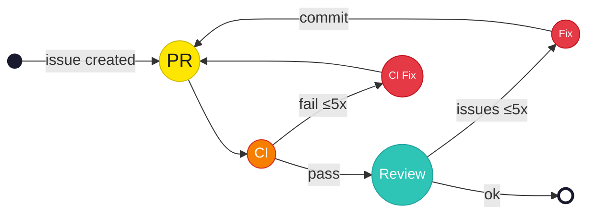

# claude-code-actions

A complete set of GitHub Actions workflows that let Claude autonomously work on your codebase — from issue to merged PR.

## What it does

Label a GitHub issue with `claude` (or `@claude` in a comment), and Claude will:

1. **Work on the issue** — reads the issue, writes code, pushes to a `claude/issue-*` branch
2. **Create a PR** — automatically, with the issue title and a `Closes #N` link
3. **Generate a PR description** — Claude reads the diff and writes a summary
4. **Close the issue** — once the PR is created
5. **Review the PR** — Claude reviews its own code (or any PR) for bugs, logic errors, and security issues
6. **Fix review issues** — Claude reads review comments and pushes fixes
7. **Fix CI failures** — if CI fails on a `claude/` branch, Claude reads the logs and pushes a fix (up to 5 iterations)

The review → fix → review loop continues automatically until all issues are resolved or the iteration limit is hit. You can dismiss review issues with a 👎 reaction to skip them in future rounds.



## Workflows

| Workflow | Trigger | What it does |
|----------|---------|-------------|
| `claude.yml` | `@claude` mention or `claude` label | Entry point — Claude works on issues/PRs |
| `auto-create-claude-pr.yml` | `claude/issue-*` branch push | Creates PR from Claude's branch |
| `auto-close-claude-issues.yml` | After PR creation | Closes the source issue |
| `auto-describe-claude-pr.yml` | After PR creation | Generates PR description |
| `claude-code-review.yml` | PR opened/updated | Reviews code for real issues |
| `claude-code-fix.yml` | Review finds issues | Fixes review issues |
| `claude-ci-fix.yml` | CI fails on `claude/` branch | Reads CI logs and fixes errors |

## Install

### Quick install

```bash
git clone https://github.com/hauxir/claude-code-actions.git /tmp/cca
/tmp/cca/install.sh
```

This copies all workflows and scripts into your repo, skipping any files that already exist.

### Manual install

Copy these into your repo:
- `.github/workflows/` — all 7 workflow files
- `.github/actions/setup-dev-env/action.yml` — dev environment setup (customize this)
- `scripts/github/` — 6 helper shell scripts

## Setup

### 1. Configure your dev environment

Edit `.github/actions/setup-dev-env/action.yml` to install your project's dependencies (Node, Python, Rust, etc.). This runs before Claude in every workflow.

### 2. List your CI workflows

Edit `.github/workflows/claude-ci-fix.yml` and add your CI workflow names under the `workflows:` trigger:

```yaml
on:
  workflow_run:
    workflows:
      - CI
      - Tests
      - Lint
    types: [completed]
```

### 3. Add repository secrets

| Secret | Description |
|--------|-------------|
| `CLAUDE_CODE_OAUTH_TOKEN` | Claude Code OAuth token (from [claude.ai](https://claude.ai)) |
| `GH_PAT` | GitHub Personal Access Token with `repo` scope (needed for Claude to push commits that trigger other workflows — `GITHUB_TOKEN` can't do this) |

### 4. Default branch

The workflows assume `master` as the default branch. If you use `main`, find-and-replace `master` → `main` in the workflow files.

## How the review/fix loop works

```
PR opened/updated
    ↓
Claude Code Review
    ↓ (posts issues as PR comments)
    ↓
Claude Code Fix
    ↓ (fixes issues, pushes commit)
    ↓
Claude Code Review (re-triggered)
    ↓
... repeats until clean or iteration limit (5) reached
```

Each review issue is posted as a separate PR comment with a `<!-- claude-review-issue -->` marker. You can:
- **👎 react** to dismiss an issue (won't be flagged again)
- Issues that get fixed receive a 🎉 reaction automatically

## Customization

### Prompts

Each workflow has a `prompt:` field you can edit to change Claude's behavior. For example, add your project's conventions, testing requirements, or review criteria.

### Iteration limits

- **CI fix**: Max 5 iterations (configurable in `claude-ci-fix.yml`)
- **Review/fix loop**: Max 5 iterations (configurable in `scripts/github/find-open-review-issues.sh`)

### CLAUDE.md

Add a `CLAUDE.md` file to your repo root with project-specific instructions. Claude reads this automatically and follows the conventions you specify.

## License

MIT
